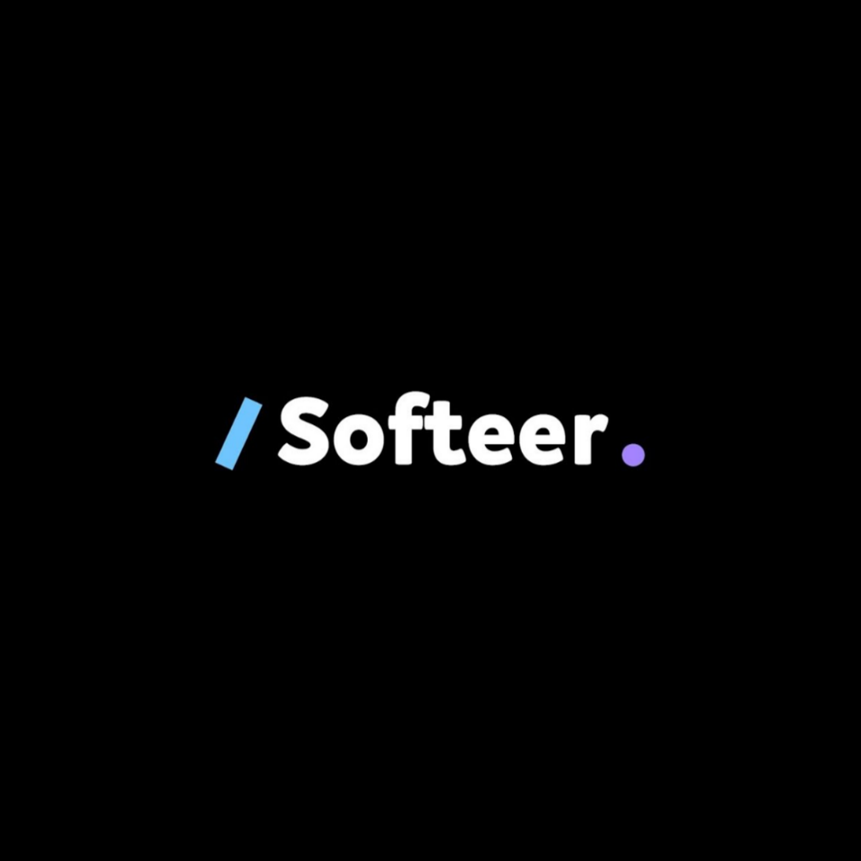

# [쿠크다스 스터디]

## 소개

알고리즘 스터디 쿠크다스 입니다.
현재 Java, Python으로 진행합니다. (언어는 상관없습니다.)

## 커리큘럼

수학 -> 자료구조 -> 그리디 -> 재귀 -> DP -> 그래프(DFS/BFS) ->  

완전탐색, 시뮬레이션, 구현, 문자열 -> 백트랙킹 -> 최단경로 -> 

이분탐색 -> 분할정복 -> 투 포인터, 슬라이딩 윈도우

~~1주차 - code up 100제 or 백준 새싹문제 or 프로그래머스 0lv // 수학, 자료구조~~

2주차 - 그리디, 재귀, DP + (시뮬레이션, 구현)

3주차 - 그래프(DFS/BFS), 완전탐색 + (시뮬레이션, 구현)

4주차 - 백트랙킹, 최단경로 + (시뮬레이션, 구현)

5주차 - 이분탐색, 분할정복 + (시뮬레이션, 구현)

.

.

.

## 커뮤니티

<!--

**Here are some ideas to get you started:**

🙋‍♀️ A short introduction - what is your organization all about?
🌈 Contribution guidelines - how can the community get involved?
👩‍💻 Useful resources - where can the community find your docs? Is there anything else the community should know?
🍿 Fun facts - what does your team eat for breakfast?
🧙 Remember, you can do mighty things with the power of [Markdown](https://docs.github.com/github/writing-on-github/getting-started-with-writing-and-formatting-on-github/basic-writing-and-formatting-syntax)
-->
